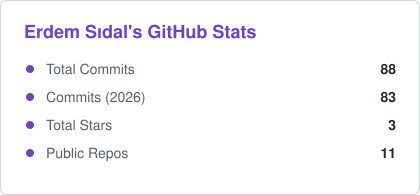
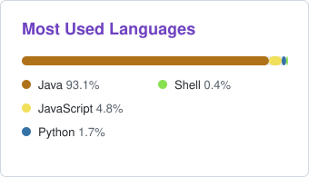
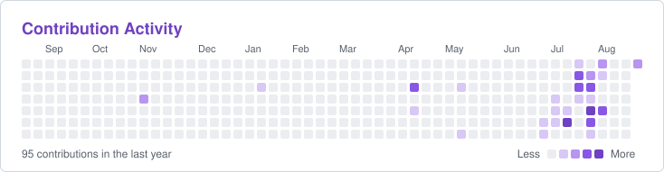

<h1 align="center">Hi there, I'm Erdem Sıdal 👋</h1>

  <em>Backend & Security-focused Software Developer</em> 
  Java ☕ · Python 🐍 · System Design 🏗️ · Turkey 🇹🇷

  
  

---

## 🙋‍♂️ About Me

- 💻 Backend developer focused on **Java** & the **Spring** ecosystem.
- 🐍 Also work with **Python** — including **computational biology / protein** research & data analysis.
- 🔐 Interested in **application security** — authentication, auditing & secure coding.
- ☁️ Into **DevOps**: **AWS**, **Docker**, CI/CD, and cloud-native architecture.
- 🌱 Always learning: clean architecture, testing, and scalable system design.
- 📫 Reach me: **erdemsidal@hotmail.com**

---

## 🛠️ Tech Stack

  
  
  
  
  
  
  
  
  
  

---

## 📊 GitHub Statistics

  <picture>
    <source media="(prefers-color-scheme: dark)" srcset="assets/stats-dark.svg"/>
    
  </picture>
  <picture>
    <source media="(prefers-color-scheme: dark)" srcset="assets/langs-dark.svg"/>
    
  </picture>

  

---

## 📈 Contribution Activity

  <picture>
    <source media="(prefers-color-scheme: dark)" srcset="assets/contribs-dark.svg"/>
    
  </picture>

---

## 📌 Featured Projects

- 🗂️ **[collab-board](https://github.com/erdemsidal/collab-board)** — Real-time collaborative Kanban board with instant multi-user sync and optimistic-versioning conflict resolution.
- 🎼 **[orchestra](https://github.com/erdemsidal/orchestra)** — Distributed, asynchronous job processing service with clean, event-driven architecture (Java 21, Spring Boot 3, PostgreSQL, AWS SQS).
- 🔐 **[auth-security-audit](https://github.com/erdemsidal/auth-security-audit-)** — Authentication & security auditing project (Java).

---

## 🌐 Connect With Me

  
  

<em>"First, solve the problem. Then, write the code."</em>

